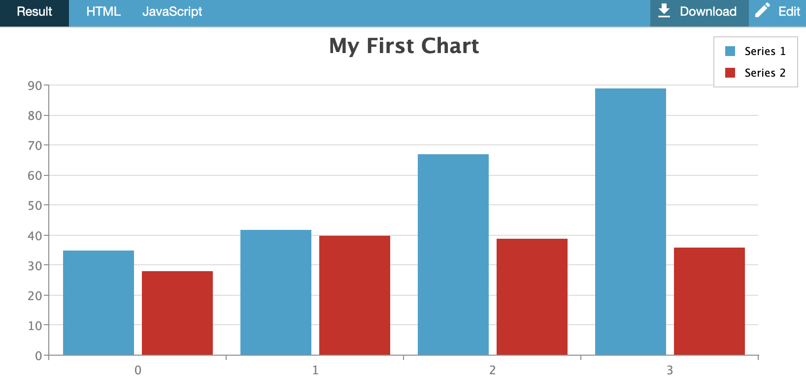

# Your First JavaScript Chart

### Hello ZingChart World



Use the following steps to get your first chart going

1. Copy the following script tag:

```text
<script src="https://cdn.zingchart.com/zingchart.min.js"></script>
```


Our CDN service is intended as an introductory tool. Once familiarized, we highly recommend users either download ZingChart to their own environment or access it through their preferred package manager.


2. Paste inside the `<head></head>` tag.

3.  [Make your first chart!](https://codepen.io/zingchart/project/editor/AwByYx)

```markup
<!DOCTYPE html>
<html>
<head>
  <meta charset="utf-8">
  <!--Script Reference[1]-->
  <script src="https://cdn.zingchart.com/zingchart.min.js"></script>
</head>
<body>
  <!--Chart Placement[2]-->
  <div id="chartDiv"></div>
  <script>
    var chartData = {
      type: 'bar',  // Specify your chart type here.
      title: {
        text: 'My First Chart' // Adds a title to your chart
      },
      legend: {}, // Creates an interactive legend
      series: [  // Insert your series data here.
          { values: [35, 42, 67, 89]},
          { values: [28, 40, 39, 36]}
      ]
    };
    zingchart.render({ // Render Method[3]
      id: 'chartDiv',
      data: chartData,
      height: 400,
      width: 600
    });
  </script>
</body>
</html>
```

### Notes

1. _Script Reference_ - The main ZingChart script reference includes the vast majority of our chart types and features. A few of our more advanced options \(e.g., Map charts, dragging tool, selection tool, 3D toolbar\) do require the addition of individual module scripts. For more information, see our [Modules](https://www.zingchart.com/docs/api/modules/standard/) page.
2. _Render Method_ - This is where your chart is rendered with its corresponding data. The element id `chartDiv`and data `chartData` is specified here. Within your render method, you can also adjust your chart's height, width, and rendering type \(SVG or canvas\). See our [Render Options](https://www.zingchart.com/docs/api/zingchart-object/#zingchart__render) page for more information.
3. _Chart Placement_ - The template starts you off with a single chart. To add a second \(or more\) charts, see our [Adding Additional Charts](https://www.zingchart.com/docs/getting-started/adding-more-charts/) page.
4. **Advanced Developers:** Download the ZingChart library or get it from [GitHub](https://github.com/zingchart/ZingChart), and then place the scripts in your working directory.


#### Direct Download



#### Github




