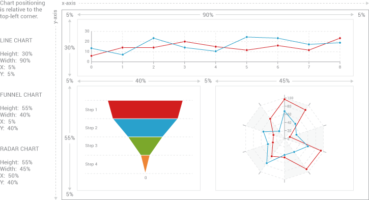

# Adding Additional Charts

### Overview

You can add additional charts to your page in one of two ways. The first way is to create charts individually. Each chart requires a new div element, chart variable \(to contain your chart data\), and render method. The second way is to create a graphset array. The array can contain multiple chart objects, enabling you to manage and present them as a dashboard or trellis chart. See our ZingChart Gallery for examples.

1. [Individual Charts Method](https://www.zingchart.com/docs/getting-started/adding-more-charts/#additional_charts__individual)
2. [Graphset Array Method \(Dashboard Charts, Trellis Charts\)](https://www.zingchart.com/docs/getting-started/adding-more-charts/#additional_charts__graphset)

Which method you choose depends on what you're trying to accomplish. Creating charts individually gives you direct control. Since they're unrelated, you can place each chart wherever you like in the document `<body>`. Dashboard charts are best for charts that relate or speak to each other in some way. They're contained in a single `div` element, which means they're controlled as a group. To see several charts \(as individual charts and as a dashboard\) together in a full HTML document, go to our [Adding Additional Charts Template](https://www.zingchart.com/docs/getting-started/adding-more-charts/#additional_charts__template) below.

### Individual Charts Method

This method has three parts. For each new chart, you need to add a `div` element in the document `<body>`, as well as a chart variable \(to contain your chart data\) and render method in the document `<head>`.  


#### 1. `div` Element

Add your `div` elements to your document `<body>`. These elements act as the containers for your charts, and you can place them between text, graphics, and other charts on your webpage. Make sure to assign each `div`element a unique `id` \(e.g., `"chartDiv1"`, `"chartDiv2"`, `"chartDiv3"`, etc.\).

**Note:** Unique identifiers are case-sensitive. `chartDiv1` is not the same thing as `ChartDiv1`.

```markup
<body>
  <!-- Unique div element identifier for each new chart -->
  <div id='chartDiv1'></div>
  <div id='chartDiv2'></div>
  <div id='chartDiv3'></div>
</body>
```

#### 2. Variable \(and Chart Data\)

Insert your chart variables in the document `<head>`. These variables store your chart data. Make sure to assign each variable a unique variable name \(e.g., `myChart1`, `myChart2`, `myChart3`, etc.\).


Variable names are case-sensitive. `myChart1` is not the same thing as `MyChart1`.


Within each variable, insert your chart data. Remember that at a minimum, you need to provide your chart type and series data. \(See our [Your First Chart](https://www.zingchart.com/docs/getting-started/your-first-chart/) page if you need a refresher.\) For an overview of our different chart types, see our [Chart Types](https://www.zingchart.com/docs/chart-types/) page and [ZingChart Gallery](https://www.zingchart.com/gallery/).

```markup
<head>
...
<script>
  /* Unique variable names and chart data */
  var myChart1 = {
    "type":"area",
    "series":[
      {"values":[76,23,15,85,13]}
    ]
  };
  var myChart2 = {
      "type":"bullet",
      "series":[
        {"values":[14,29,18,20,34], "goals":[15,30,21,5,30]}
      ]
  };
  var myChart3 = {
      "type":"pie",
      "series":[
        {"values":[15]}, 
        {"values":[30]}, 
        {"values":[34]}
      ]
  };
  /* Your render methods are added after this. */
...
</script>
</head>
```

#### 3. Render Method <a id="toc_4"></a>

Finally, add your render methods to the document `<head>`, inside the `window.onload=function(){}` event handler. Make sure to include your chart's `div` element \(by its unique `id`\) and variable \(by its variable name\).

```markup
<head>
...
<script>
...
  /* Your variables and chart data are added before this. */                             
  window.onload=function(){
    /** 
    * Render methods, which reference your charts'
    * div element identifiers and variable names.
    */
    zingchart.render({
      id:'chartDiv1',
      data:myChart1,
      height:300,
      width:500
    });
    zingchart.render({
      id:'chartDiv2',
      data:myChart2,
      height:300,
      width:500
    });
    zingchart.render({
      id:'chartDiv3',
      data:myChart3,
      height:300,
      width:500
    });
  };
</script>
</head>

```

To see all three parts in a single HTML document, go to our [Adding Additional Charts Template](https://www.zingchart.com/docs/getting-started/adding-more-charts/#additional_charts__template). \(The template also includes a sample dashboard chart.\)

### Graphset Array Method \(Dashboard Charts, Trellis Charts\)

Both dashboard charts and trellis charts combine multiple charts that typically share underlying or related data. To create one, you need to add a graphset array into the document `<head>`. You then add objects containing your chart data into it. You'll also need to size and position your dashboard to achieve the layout and appearance that you want.


A dashboard chart is different from a mixed chart. A dashboard chart consists of 2 or more separate charts. A [mixed chart](https://www.zingchart.com/docs/chart-types/mixed-charts/) refers to a single chart that contains 2 or more different plot types \(e.g., one plot as a bar, another plot as a line, etc.\).


#### 1. Graphset Array \(and Chart Data\) <a id="toc_6"></a>

Insert a graphset array into the document `<head>`. For each of your charts, create an object to contain your chart data. \(You need to provide your chart type and series data at a minimum. See our [Your First Chart](https://www.zingchart.com/docs/getting-started/your-first-chart/) page if you need a refresher. See our [Chart Types](https://www.zingchart.com/docs/chart-types/) and [Gallery](https://www.zingchart.com/gallery/) pages for an overview and examples of all of the different chart types.\)

```markup
<head>
...
<script>
  var myDashboard = {
    /* Graphset array */
    "graphset":[
      { /* Object containing chart data */
        "type":"line",
        "series":[
          {"values":[11,21,19,54,6,19,19,59]}]
      },
      { /* Object containing chart data */
        "type":"funnel",
        "series":[
          {"values":[30]}, 
          {"values":[15]}, 
          {"values":[5]}, 
          {"values":[3]}
        ]
      },
      {
        "type":"radar",
        "series":[
          {"values":[20,87,59,85,54]}]
      }
    ]
  };
...
</script>
</head>

```

#### 2. Sizing and Positioning your Dashboard or Trellis Chart <a id="toc_7"></a>

You can individually size each chart using the `height` and `width` attributes. You can also specify each chart's position within the dashboard using the `x` and `y` attributes. Chart positioning is relative to the top-left corner, and can be specified by percentages or pixels. We recommend using percentages to allow for proportional scaling. \(While pixels offer the advantage of specific placement and control, they do not scale.\)



```markup
<script>
  var myDashboard = {
    "graphset":[
      {
        "type":"line",
        /* Size your chart using height/width attributes */
        "height":"30%",
        "width":"90%",
        /* Position your chart using x/y attributes */
        "x":"5%", 
        "y":"5%",
        "series":[
          {"values":[11,21,19,54,6,19,19,59]}
        ]
      },
      {
        "type":"funnel",
        /* Size your chart using height/width attributes */
        "height":"55%", 
        "width":"40%",
        /* Position your chart using x/y attributes */
        "x":"5%", 
        "y":"40%",
        "series":[
          {"values":[30]}, 
          {"values":[15]}, 
          {"values":[5]}, 
          {"values":[3]}
        ]
      },
      {
        "type":"radar",
        "height":"55%",
        "width":"45%",
        "x":"50%",
        "y":"40%",
        "series":[
          {"values":[20,87,59,85,54]}
        ]
      }
    ]
  };
...
</script>
</head>
```

To see a dashboard chart \(with corresponding render method and `div` element\) in a single HTML document, go to our [Adding Additional Charts Template](https://www.zingchart.com/docs/getting-started/adding-more-charts/#additional_charts__template). \(The template also includes several individual charts.\)  


### Adding Additional Charts Template

This template includes several individual charts and a dashboard chart. To get started, you can copy and paste it into a new HTML document. Refer to our [Chart Types](https://www.zingchart.com/docs/chart-types/) page for instructions on building specific chart types. Our [ZingChart Gallery](https://www.zingchart.com/gallery/) offers further inspiration and ideas.

```markup
<html>
<head>
<script src="http://cdn.zingchart.com/zingchart.min.js"></script>
<script>
  var myChart1 = {
    "type":"area",
    "series":[
      {"values":[76,23,15,85,13]}
    ]
  };
  var myChart2 = {
    "type":"bullet",
    "series":[
      {"values":[14,29,18,20,34], "goals":[15,30,21,5,30]}
    ]
  };
  var myChart3 = {
    "type":"pie",
    "series":[
      {"values":[15]}, 
      {"values":[30]}, 
      {"values":[34]}
    ]
  };
  var myDashboard = {
    "graphset":[
      {
        "type":"line",
        "height":"30%",
        "width":"90%",
        "x":"5%",
        "y":"5%",
        "series":[
          {"values":[11,21,19,54,6,19,19,59]}
        ]
      },
      {
        "type":"funnel",
        "height":"55%",
        "width":"40%",
        "x":"5%",
        "y":"40%",
        "series":[
          {"values":[30]}, 
          {"values":[15]}, 
          {"values":[5]}, 
          {"values":[3]}
        ]
      },
      {
        "type":"radar",
        "height":"55%",
        "width":"45%",
        "x":"50%",
        "y":"40%",
        "series":[
          {"values":[20,87,59,85,54]}
        ]
      }
    ]
  };
window.onload=function(){
  zingchart.render({
    id:'chartDiv1',
    data:myChart1,
    height:300,
    width:500
  });
  zingchart.render({
    id:'chartDiv2',
    data:myChart2,
    height:300,
    width:500       
  });
  zingchart.render({
    id:'chartDiv3',
    data:myChart3,
    height:300,
    width:500
  });
  zingchart.render({
    id:'dashboardDiv',
    data:myDashboard,
    height:500,
    width:700
  });
};
</script>
</head>
<body>
  <h1>Adding Additional Charts Template</h1>
  <h2>Individual Charts</h2>
  <p>Below is an area chart, bullet chart, and pie chart.</p>
  <p><u>Remember</u>: Each chart requires its own div element, variable (to contain chart data), and render method.</p>
  <h3>Area Chart</h3>
  <div id='chartDiv1'></div>
  <h3>Bullet Chart</h3>
  <div id='chartDiv2'></div>
  <h3>Pie Chart</h3>
  <div id='chartDiv3'></div>
  <h2>Dashboard Chart</h2>
  <p> Below is a dashboard chart, containing an area chart, bullet chart, and radar chart.</p>
  <p><u>Remember</u>: You can size and position your charts using the "height", "width", "x", and "y" attributes. Chart positioning is relative to the top-left corner. You can use percentages (which allow for proportional scaling) or pixels (which offer more specific control) for your measurements.</p>
  <div id='dashboardDiv'></div>
</body>
</html>
```

